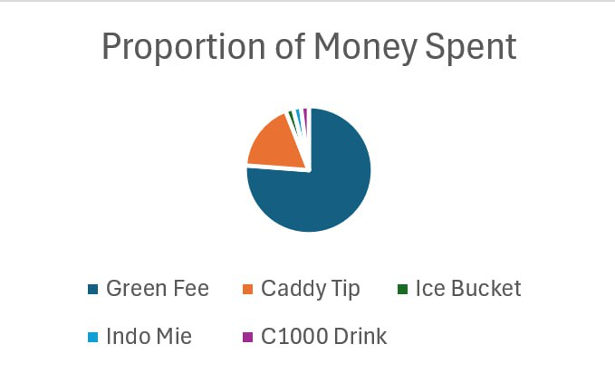
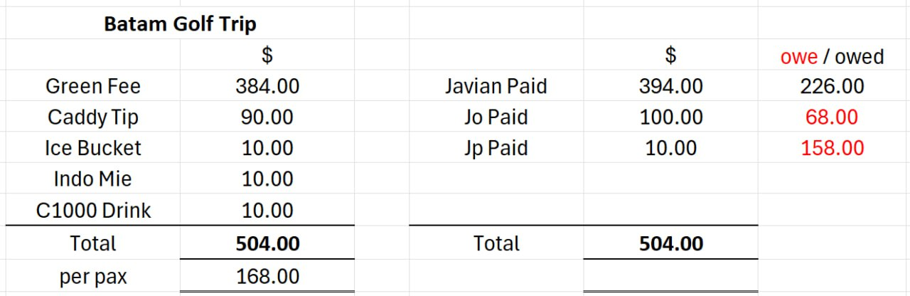

# Overkill Golf Trip Receipt Generator

My friends sent me a golf trip receipt with a pie chart and Excel table (see below). I decided to build a shareable receipt generator for fun, making it easy to create and share detailed expense breakdowns for golf trips.

## Features

- **Interactive Expense Tracking**: Add and manage multiple expenditures with descriptions and amounts
- **Payment Management**: Track payments made by different participants
- **Real-time Calculations**: Automatic calculation of who owes what to whom
- **Visual Analytics**: Beautiful pie chart visualization of expense distribution
- **Shareable Links**: Generate unique URLs to share your expense breakdown with others
- **Editable Title**: Customize the title of your expense sheet
- **Responsive Design**: Works seamlessly on both desktop and mobile devices

## How It Works

1. Add your expenditures with descriptions and amounts
2. Record payments made by participants
3. View the automatic calculation of who owes what
4. Generate a shareable link to send to your friends
5. Share the expense breakdown with your golf buddies

The application uses modern web technologies including:
- Chart.js for visualizations
- Bootstrap (Not the biggest fan of the design but quick project for fun...)
- JavaScript for dynamic calculations and interactivity

